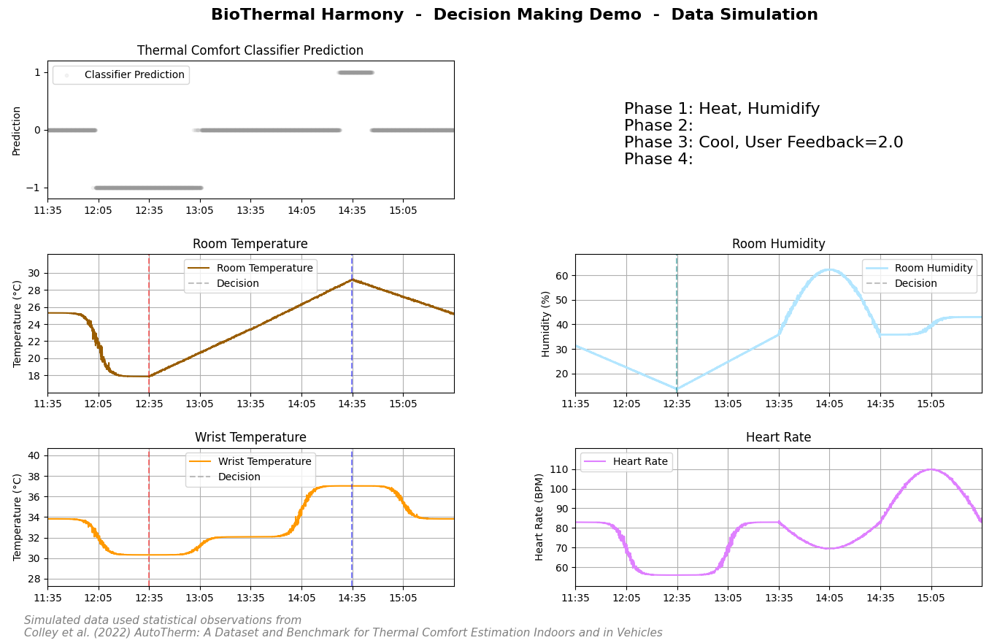

Hi there 👋

My name is Patrick & I'm currently a Master student in Information Systems at Karlsruhe Institute of Technology (KIT) in Germany.

💼 I work part-time as a Junior Researcher at the Applied AI in Services Lab @ Karlsruhe Service Research and Innovation Hub (KSRI). I am currently working on the BMWK-funded research project [NaiS](https://nais.tech/) in the construction domain, where I apply deep learning computer vision methods (object detection & semantic segmentation) and geometric optimizations to digitize analog data such as floor plans.

💡 My core interests are centered around AI, Deep Learning, Computer Vision, Multimodal AI & Document Understanding. This is also reflected in my academic curriculum, which aims to specialize in these areas.

💾 Recognizing data as one of the key components of any modern use case, some of my focus is skillset is related to data understanding, data curation & synthetic data.

📚 It's still early in my career, so there's still a lot to learn, but I'm driven to connect my studies to work and impact in the real world. Bringing industry and research together to foster innovation is something I strongly believe in.

🧑🏽‍💻 Given my technical focus, I enjoy & thrive in developing applications. Strategically designing end-to-end workflows is one of my strengths. In addition, I strive for proper human-computer interaction to enhance performance.

# Projects

Here I'll show you some highlights from past projects. Please keep in mind that all of this is still under construction & will be updated irregularly.

## [KIT] Engineering Interactive Systems: Wearables & AI

As part of a capstone project I was part of a team of students working on improving the individual thermal comfort of people working from home with a smart home system present. As part of this project, I developed a classifier that predicts thermal comfort and makes decisions accordingly. To verify the performance of our systems, I created a simulation that applied our decision making process at certain time intervals & adjusted the simulation accordingly. Here's the final result visualizing the simulation:

<!--
**biggeR-data/biggeR-data** is a ✨ _special_ ✨ repository because its `README.md` (this file) appears on your GitHub profile.

Here are some ideas to get you started:

- 🔭 I’m currently working on ...
- 🌱 I’m currently learning ...
- 👯 I’m looking to collaborate on ...
- 🤔 I’m looking for help with ...
- 💬 Ask me about ...
- 📫 How to reach me: ...
- 😄 Pronouns: ...
- ⚡ Fun fact: ...
-->
